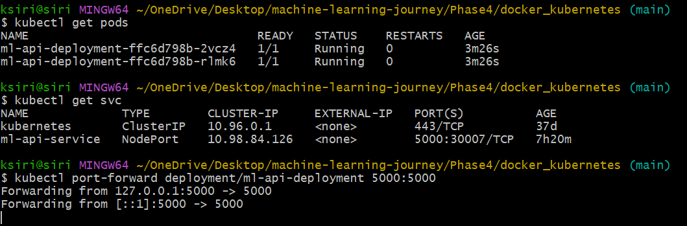

# 🐳 Docker & ☸️ Kubernetes for AI/ML Deployment

This notebook introduces **containerization** and **orchestration** using **Docker** and **Kubernetes** for deploying AI/ML models.

By the end of this notebook, you will learn:
- How to containerize a simple ML model API using **Docker**
- How to deploy that container using **Kubernetes (minikube or local cluster)**
- Why containerization and orchestration are essential for **scalable AI systems**

---

## 🐳 What is Docker?

Docker is a platform that allows you to **package, distribute, and run applications** in **lightweight containers**.

**Key Concepts:**
- **Image:** Blueprint of your app (contains code, dependencies, environment).
- **Container:** Running instance of an image.
- **Dockerfile:** Text file defining how to build the image.
- **Docker Hub:** Registry for storing and sharing images.

### Why Docker for AI/ML?
- Ensures environment consistency between dev and production.
- Simplifies deployment of ML models (no dependency conflicts).
- Supports GPU acceleration for model inference.
- Works seamlessly with MLOps tools (SageMaker, Kubeflow, etc.).

---

## 🐳 Dockerfile

A **Dockerfile** defines how your image is built.

## 🔧 Build & Run Docker Container

Open your terminal in the same directory as `Dockerfile` and run:

```bash
# Build image
docker build -t ml-api .

# Run container
docker run -p 5000:5000 ml-api
```
This will start your ML API on `http://localhost:5000`.

---


### ☸️ **Introduction to Kubernetes**

## ☸️ What is Kubernetes?

Kubernetes (K8s) is an **orchestration system** for managing containerized applications.

### Core Concepts:
- **Pod:** Smallest deployable unit (runs one or more containers).
- **Deployment:** Manages pods (scaling, updates).
- **Service:** Exposes your app to external traffic.
- **Ingress:** Routes external HTTP(S) traffic.

### Why Kubernetes for AI/ML?
- Automates scaling and recovery of ML APIs.
- Enables distributed deployment of multiple models.
- Works with GPU nodes for inference acceleration.

---

## 🚀 Deploying with Kubernetes

Use **minikube** or **kind** for local deployment.

```bash
# Start minikube
minikube start

# Apply deployment and service
kubectl apply -f deployment.yaml
kubectl apply -f service.yaml

# Check resources
kubectl get pods
kubectl get svc
```


---

### 🧩 **Cell 12: Cleanup**

## 🧹 Cleanup

After you’re done testing:

```bash
kubectl delete -f deployment.yaml
kubectl delete -f service.yaml
minikube stop
docker system prune -f
```

